# AIigatou_AI
> Team #15 in #AI_Artathon 2020

In this project I'll explaine our pipeline from the preprocessing of our datasets, training CycleGAN model, till we finaly upscaled the output and discared the noise. 

## Table of Contents

>`Preprocessing`
- [Dataset Segmentation](#segmentation)
- [Dataset Outlines](#outlines)
- [Dataset Augmentation](#augmentation)

>`Model Training`
- [CycleGAN](#training)

>`Postprocessing`
- [Upscale](#upscale)
- [Noise Reduction](#noise)

>`WebApp`
- [Try it Out](#features)

>`Info`
- [Team](#team)
- [FAQ](#faq)

## Datasets Preprocessing
In the cycleGAN archetucture, there are two GAN models. Each GAN model need to be trained on distinguished dataset inorder to come with something new. Since my team and I want to work with our own dataset, we came up with a way to have differnet representation of our dataset. We took our dataset, applay segmentation to it, then took the segmented dataset, then took the outlines of it. This may look similar to the pix2pix method `but we did not paire the images`. Simply we augmented the two datasetes after we took the outlines of the outlies of the segmented data.

### Segmentation
In order to get our segmented dataset, we used unsupervised algorithm `K-mean` to cluster the colors in an image.  For expermintal purposes we tried to to cluster 2 colors in an image and 3 colors. Then we notice that some of the images looks abslotly different with the different clusters number. So for some cases we took the both clustering results.
| Original | Segmententation 3 | Segmentation 2 |
| ------------- | ------------- | ------------- |
|| | |

### Outlines 
We tried to use the Segmented dataset as the Dataset B with the Original dataset as Dataset A, but we were not pleased with the outcomes. Therefore, we thought about a way to increase the varaity between our A/B datasets, and this is how we get to extract the outlines of our drawings as the second dataset. `Please notice that this is NOT paired images approach`.
We extracted the outlines of our segmented drawings.
| 3 Colors Segment | Outline | 2 Colors Segment | Outline |
| ------------- | ------------- | ------------- |------------- |
| |  | | |

### Augmentation 
Finally the last step in preprocessing, we used `Augmentor` in order increase the number of examples in out dataset.  We have initially 121 original drawings from our artist, we segmented these images and then took the outlines to have a second dataset. Then we augmented these two datasets differently to gaine 500 examples each to trian our cycleGAN. We took our time in order to get the optimal augmentatios pipeline for our dataset. We experment with earasing, flip_top_down, chainging colors, random_distortion, gaussian_distortion, zooming, and rotate for more than 15˚. But as cool as these augmentation options are, they did not work well with our dataset. So our pipeline consist of (random flip, random 90˚ rotate, random 15˚ rotate) for 70% of each dataset and resize all of them to (256px * 256px). These are examples of our final two datasets.
| Datasets | The | Joy Of | Augmentation |
| ------------- | ------------- | ------------- | ------------- |
| *Dataset A*     | 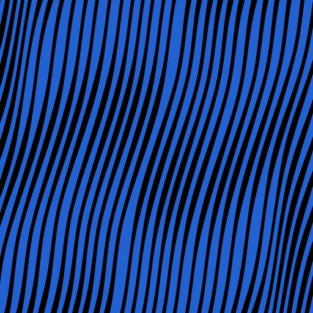|  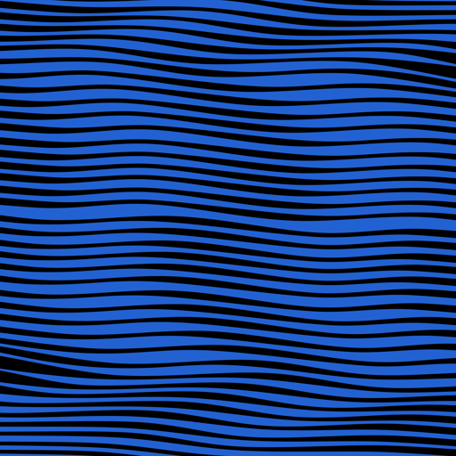| 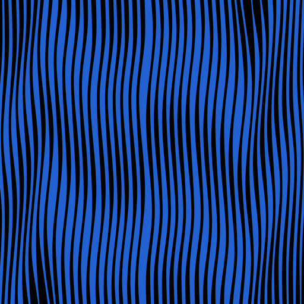|
| *Dataset B*     | 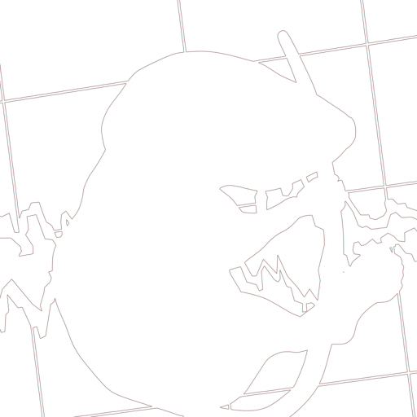|  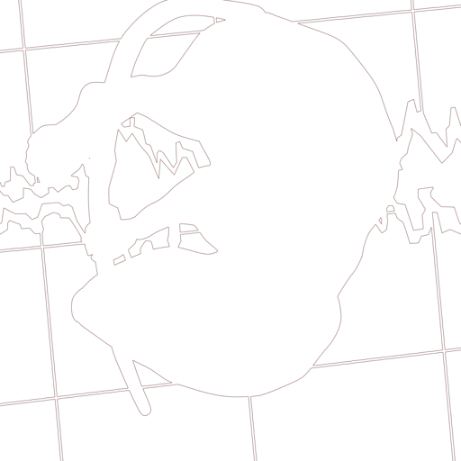| 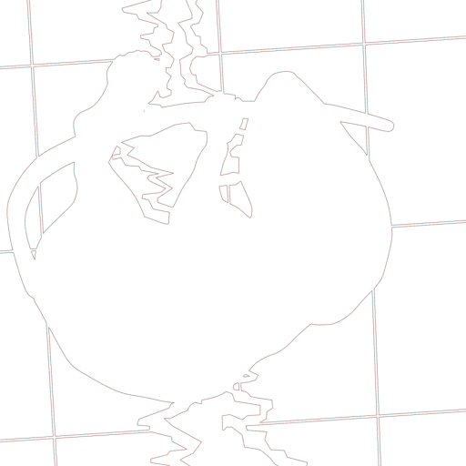|

## Model Training
We choose to train CycleGAN model becuse of several reasons. One of the reasons is that we got inspired by the art of [Helena Sarin](https://twitter.com/glagolista) and her method. She used her own dataset to traine a cycleGAN model to make a beatiful art pieces of flowers. We were initially aiming to traine a GAN model but the intresing archetucture of CycleGAN make it need for less data to train on which is perfect in our case since our dataset is originals of our artsit. 

### Training
| Searching | For the Training | Sweet Spot |
| ------------- | ------------- | ------------- |
| 100 EPOCHS | 200 EPOCHS | 300 EPOCHS  |
| 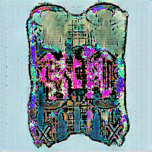 | 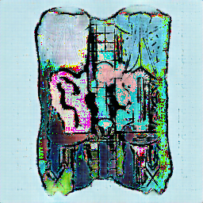 | 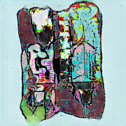  |
| 500 EPOCHS  | 600 EPOCHS  | 700 EPOCHS  |
| 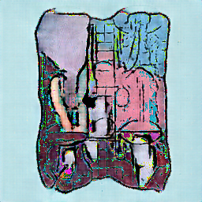 | 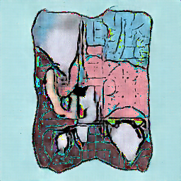  |   |

## Postprocessing
After we trained our model, and was pleased and inspired by the generated images, now we need to fix the matter of the images quality to be more appealing to the eye. We used `Waifo` tool to reach our goal.
| Generated | Upscaled | Noise Reduction|
| ------------- | ------------- | ------------- |
| |  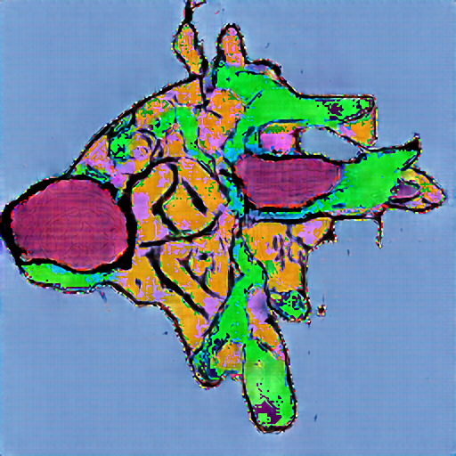| |
### Upscale
We applied this method twice to reach the output of 1024.
### Noise
We aplllied the noise reduction with the noise level 3 also twice.

