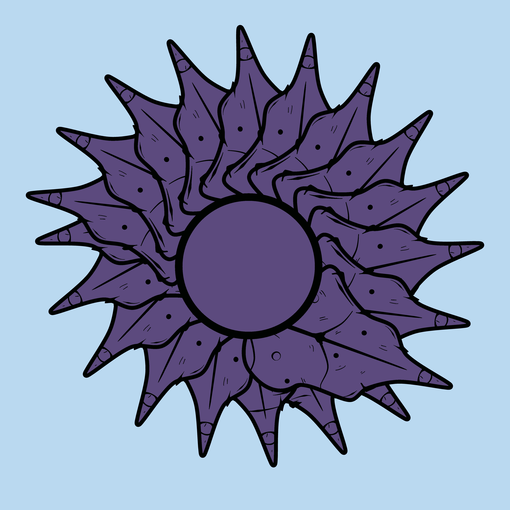
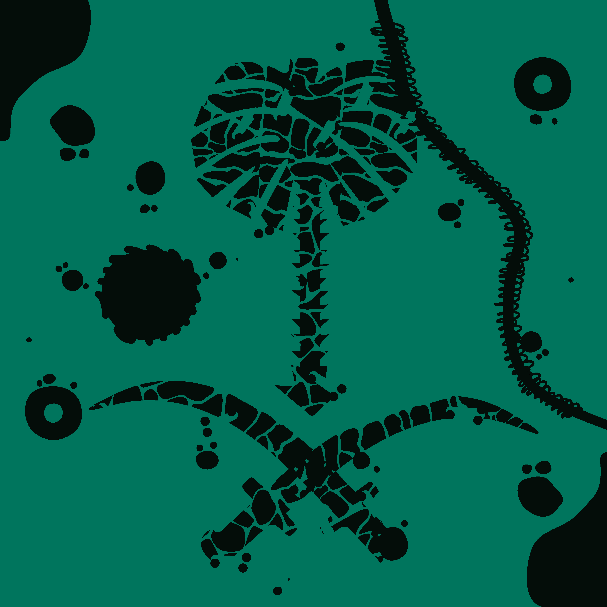
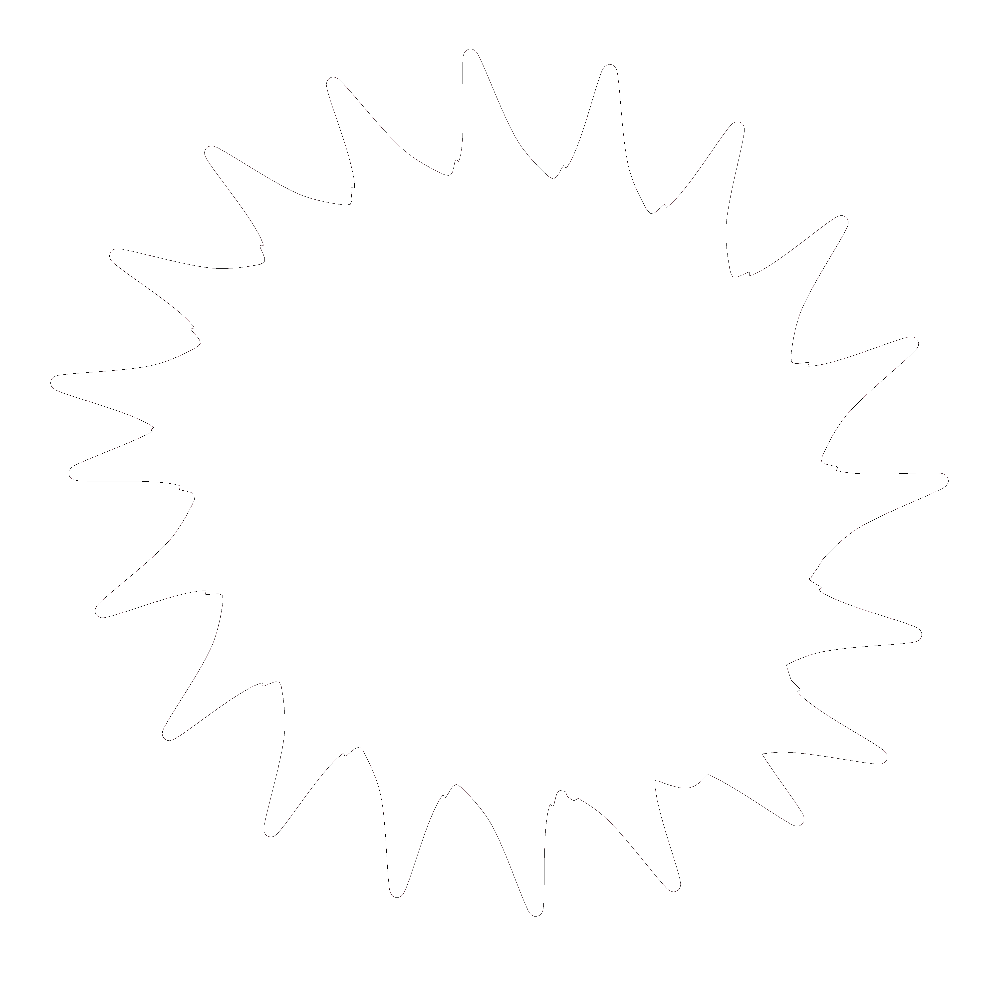

# AIigatou_AI
> Team #15 in #AI_Artathon 2020

In this project I'll explaine our pipeline from the preprocessing of our datasets, training CycleGAN model, till we finaly upscaled the output and discared the noise. 

## Table of Contents

>`Preprocessing`
- [Dataset Segmentation](#segmentation)
- [Dataset Outlines](#outlines)
- [Dataset Augmentation](#augmentation)

>`Model Training`
- [CycleGAN](#training)

>`Postprocessing`
- [Upscale](#upscale)
- [Noise Reduction](#noise)

>`Website`
- [Try it Out](#features)

>`Info`
- [Team](#team)
- [FAQ](#faq)

## Datasets Preprocessing
In the cycleGAN archetucture, there are two GAN models. Each GAN model need to be trained on distinguished dataset inorder to come with something new. Since my team and I want to work with our own dataset, we came up with a way to have differnet representation of our dataset. We took our dataset, applay segmentation to it, then took the segmented dataset, then took the outlines of it. This may look similar to the pix2pix method `but we did not paire the images`. Simply we augmented the two datasetes after we took the outlines of the outlies of the segmented data.

### Segmentation
In order to get our segmented dataset, we used unsupervised algorithm `K-mean` to cluster the colors in an image.  For expermintal purposes we tried to to cluster 2 colors in an image and 3 colors. Then we notice that some of the images looks abslotly different with the different clusters number. So for some cases we took the both clustering results.
| Original | Segmententation 3 | Segmentation 2 |
| ------------- | ------------- | ------------- |
|| | |

### Outlines 
We tried to use the Segmented dataset as the Dataset B with the Original dataset as Dataset A, but we were not pleased with the outcomes. Therefore, we thought about a way to increase the varaity between our A/B datasets, and this is how we get to extract the outlines of our drawings as the second dataset. `Please notice that this is NOT paired images approach`.
We extracted the outlines of our segmented drawings.
| 3 Colors Segment | Outline | 2 Colors Segment | Outline |
| ------------- | ------------- | ------------- |------------- |
| |  | | |

### Augmentation 
|  |  |  |  |
| ------------- | ------------- | ------------- | ------------- |
| *Dataset A*     | |  | |
| *Dataset B*     | |  | |

## Model Training

### Training

## Postprocessing

### Upscale
### Noise
